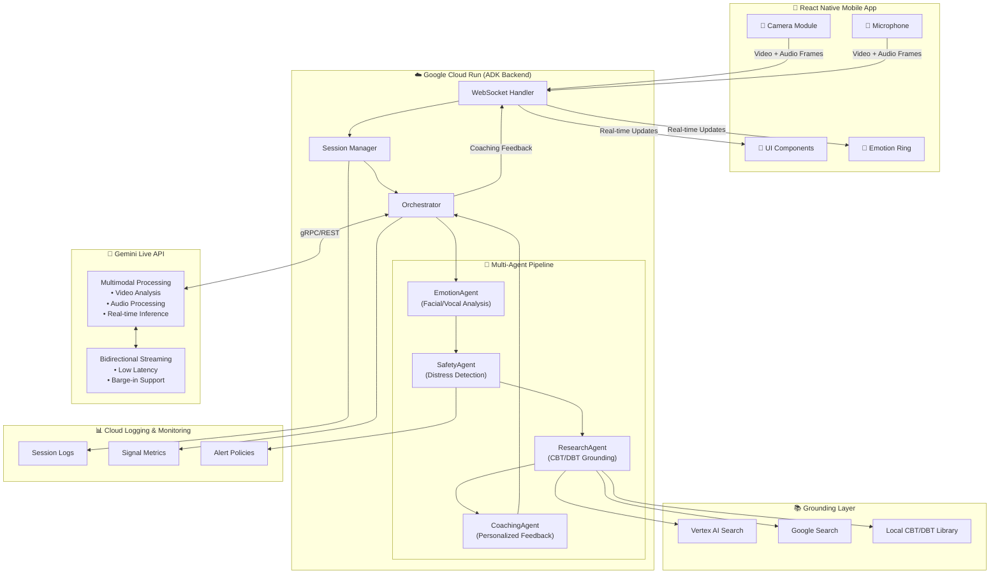

# TrueReact 🧠💬

**A Real-Time, Multimodal Social-Emotional Coach**

TrueReact helps users align their internal intent with their external social signals (facial expressions, tone, and pacing) using the power of Gemini Live API and a sophisticated multi-agent architecture.

## � Live Demo

**Web App:** [https://truereact-latest-20260316.surge.sh](https://truereact-latest-20260316.surge.sh)

> Access TrueReact directly from your browser - no installation required! Works on desktop and mobile browsers.

## 📱 Platforms

| Platform | Status | Access |
|----------|--------|--------|
| **Web** | ✅ Live | [truereact-latest-20260316.surge.sh](https://truereact-latest-20260316.surge.sh) |
| **iOS** | ✅ Ready | Run locally with Expo Go |
| **Android** | ✅ Ready | Run locally with Expo Go |

## �🎯 Mission

TrueReact isn't a chatbot—it's a persistent, "eyes-on" companion that provides:

- **Visual Calibration**: Monitors micro-expressions and posture to detect "Masking" or "Flat Affect"
- **Vocal Pacing & Affect**: Listens for pitch drops (low energy) or rapid speech (anxiety)
- **"Barge-in" Coaching**: Users can interrupt mid-session for real-time feedback
- **Real-time Emotion Visualization**: Live emotion ring with congruence tracking
- **Evidence-Based Techniques**: CBT/DBT grounded coaching suggestions

## 🏗️ Architecture

```
┌─────────────────────────────────────────────────────────────────────────────┐
│                              TrueReact Architecture                          │
├─────────────────────────────────────────────────────────────────────────────┤
│                                                                              │
│  ┌──────────────────┐     WebSocket      ┌──────────────────────────────┐  │
│  │   React Native   │◄──────────────────►│       Cloud Run (ADK)        │  │
│  │   Mobile App     │    (Secure)        │    Multi-Agent Orchestrator  │  │
│  │                  │                    │                              │  │
│  │  • Camera Feed   │                    │  ┌────────────────────────┐  │  │
│  │  • Microphone    │                    │  │   Agent Pipeline       │  │  │
│  │  • Emotion Ring  │                    │  │   Emotion → Safety →   │  │  │
│  │  • UI Overlays   │                    │  │   Research → Coaching  │  │  │
│  └──────────────────┘                    │  └────────────────────────┘  │  │
│                                          └──────────────┬───────────────┘  │
│                                                         │                   │
│                                                         │ gRPC/REST         │
│                                                         ▼                   │
│                                          ┌──────────────────────────────┐  │
│                                          │     Gemini Live API          │  │
│                                          │  (Multimodal Processing)     │  │
│                                          │                              │  │
│                                          │  • Video Analysis            │  │
│                                          │  • Audio Processing          │  │
│                                          │  • Real-time Inference       │  │
│                                          └──────────────┬───────────────┘  │
│                                                         │                   │
│                                                         │ Grounding         │
│                                                         ▼                   │
│                                          ┌──────────────────────────────┐  │
│                                          │   Enhanced Grounding Layer   │  │
│                                          │  (Multi-Source Fallback)     │  │
│                                          │                              │  │
│                                          │  • Vertex AI Search          │  │
│                                          │  • Google Search Grounding   │  │
│                                          │  • Local CBT/DBT Library     │  │
│                                          └──────────────────────────────┘  │
│                                                                              │
│  ┌──────────────────────────────────────────────────────────────────────┐  │
│  │                        Cloud Logging & Monitoring                     │  │
│  │                      (Observability & GCP Proof)                      │  │
│  └──────────────────────────────────────────────────────────────────────┘  │
│                                                                              │
└─────────────────────────────────────────────────────────────────────────────┘
```

### Architecture Diagram (Mermaid)



## 🤖 Multi-Agent Architecture (ADK)

TrueReact uses a sophisticated **Agent Development Kit (ADK)** pipeline with specialized agents:

| Agent | Role | Capabilities |
|-------|------|--------------|
| **EmotionAgent** | Real-time emotion detection | Facial/vocal analysis, congruence scoring, masking detection, emotion trending |
| **SafetyAgent** | Distress monitoring | Crisis keyword detection, risk assessment, safe-state triggers, resource recommendations |
| **ResearchAgent** | Evidence-based grounding | CBT/DBT technique library (14+ techniques), Google Search grounding, citation generation |
| **CoachingAgent** | Personalized coaching | Context-aware suggestions, neurodivergent-friendly feedback, progressive guidance |
| **Orchestrator** | Pipeline coordination | Mode management, safety overrides, response composition, agent state tracking |

### Agent Pipeline Flow
```
User Input (Video + Audio)
        │
        ▼
┌───────────────┐
│ EmotionAgent  │ ── Detects emotions, congruence, masking
└───────┬───────┘
        │
        ▼
┌───────────────┐
│ SafetyAgent   │ ── Checks for distress, can trigger safe-state
└───────┬───────┘
        │
        ▼
┌───────────────┐
│ ResearchAgent │ ── Grounds response in CBT/DBT evidence
└───────┬───────┘
        │
        ▼
┌───────────────┐
│ CoachingAgent │ ── Generates personalized coaching
└───────┬───────┘
        │
        ▼
   User Feedback
```

## 📊 Real-Time Emotion Visualization

The mobile app features **live emotion feedback**:

- **Emotion Ring**: Animated visualization that pulses based on intensity
- **Congruence Meter**: Shows alignment between internal intent and external signals
- **Masking Indicator**: Alerts when emotion masking is detected
- **Trend Graph**: Historical emotion data with bar chart visualization
- **Haptic Feedback**: Vibration alerts for significant emotional changes

## 🛠️ Technical Stack

| Component | Technology | Role |
|-----------|------------|------|
| Frontend | React Native + Expo SDK 54 | Captures real-time audio/video streams, emotion visualization |
| Web | React Native Web | Cross-platform web app with shared codebase |
| Live Logic | Gemini Live API | Processes bidirectional, low-latency multimodal streams |
| Backend | FastAPI + Cloud Run | Hosts multi-agent orchestration layer (ADK pattern) |
| Grounding | Vertex AI Search + Google Search | Multi-source evidence-based grounding with fallback |
| Database | Firebase Firestore | User data, session history, techniques progress |
| Auth | Firebase Auth | Secure user authentication |
| Hosting | Surge.sh | Static web app hosting |
| Observability | Cloud Logging | Provides the "GCP Proof" required for submission |

## 🚀 Getting Started

### Prerequisites

- Node.js 18+ (see `.nvmrc` - run `nvm use` if using nvm)
- Python 3.11+
- Google Cloud SDK (optional, for production features)

### Installation

1. **Clone the repository:**
   ```bash
   git clone https://github.com/hiyashah1098/TrueReact.git
   cd TrueReact
   ```

2. **Set up the mobile app:**
   ```bash
   cd mobile
   npm install
   npx expo install   # Links native dependencies
   ```

3. **Set up the backend:**
   ```bash
   cd backend
   python -m venv venv
   source venv/bin/activate  # On Windows: venv\Scripts\activate
   pip install -r requirements.txt
   cp .env.example .env      # Then edit .env with your API keys
   ```

4. **Configure environment variables:**
   - Edit `backend/.env` with your Google Cloud project ID and Gemini API key
   - Get a Gemini API key from [Google AI Studio](https://aistudio.google.com/apikey)

5. **Run locally:**
   ```bash
   # Backend (from backend directory)
   uvicorn src.main:app --reload --host 0.0.0.0 --port 8080

   # Mobile (in separate terminal, from mobile directory)
   npx expo start
   ```

### Troubleshooting

- **"Module not found" errors**: Run `npx expo install` in the mobile directory
- **Backend won't start**: Ensure you've activated the venv and created `.env` from `.env.example`
- **WebSocket connection fails**: Check that backend is running on port 8080

## ✅ Reproducible Testing Instructions

Use the steps below to reproduce a local run and verify core app behavior.

### 1) Install dependencies

```bash
# From repo root
cd mobile
npm install

cd ../backend
python -m venv venv
source venv/bin/activate  # Windows PowerShell: .\venv\Scripts\Activate.ps1
pip install -r requirements.txt
```

### 2) Configure environment

```bash
# From backend/
cp .env.example .env  # Windows PowerShell: Copy-Item .env.example .env
```

Fill required keys in `backend/.env`:
- `GEMINI_API_KEY`
- `GOOGLE_CLOUD_PROJECT`

### 3) Start backend

```bash
# Terminal A (from backend/)
source venv/bin/activate  # Windows PowerShell: .\venv\Scripts\Activate.ps1
uvicorn src.main:app --reload --host 0.0.0.0 --port 8080
```

Expected result:
- Uvicorn starts successfully
- Server reachable at `http://localhost:8080`

### 4) Start web client

```bash
# Terminal B (from mobile/)
npm run web
```

Expected result:
- Expo starts and prints a local web URL (commonly `http://localhost:8081` or `http://localhost:8082`)
- App loads in browser

### 5) End-to-end smoke test

1. Open the web app URL.
2. Navigate to a live session screen.
3. Confirm the app connects to backend WebSocket without errors.
4. Trigger a short audio interaction and verify coaching feedback appears.
5. Verify emotion visualization updates during interaction.

Expected result:
- No startup crashes in either terminal
- WebSocket remains connected
- Real-time feedback and UI updates are visible

## 📁 Project Structure

```
TrueReact/
├── mobile/                     # React Native app (Expo SDK 54)
│   ├── src/
│   │   ├── components/
│   │   │   ├── CoachingFeedbackOverlay.tsx  # Real-time coaching UI
│   │   │   ├── EmotionVisualizer.tsx        # Animated emotion ring
│   │   │   ├── EmotionTrendGraph.tsx        # Emotion history chart
│   │   │   ├── InterruptModal.tsx           # Barge-in question modal
│   │   │   ├── AffirmationCard.tsx          # Daily affirmation display
│   │   │   ├── BadgeUnlockNotification.tsx  # Achievement unlock animation
│   │   │   ├── MoodCheckIn.tsx              # Quick mood selector
│   │   │   ├── SessionTimer.tsx             # Session duration tracker
│   │   │   └── TechniqueBookmarks.tsx       # Bookmarked techniques
│   │   ├── screens/
│   │   │   ├── HomeScreen.tsx               # Main dashboard
│   │   │   ├── SessionScreen.tsx            # Live coaching session
│   │   │   ├── CalibrationScreen.tsx        # Initial calibration
│   │   │   ├── SafeStateScreen.tsx          # Crisis support screen
│   │   │   ├── HistoryScreen.tsx            # Session history
│   │   │   ├── TechniquesScreen.tsx         # CBT/DBT techniques library
│   │   │   ├── SettingsScreen.tsx           # User preferences
│   │   │   ├── VoiceJournalScreen.tsx       # Voice journaling
│   │   │   ├── AchievementsScreen.tsx       # Badges & streaks
│   │   │   ├── MeditationScreen.tsx         # Guided meditations
│   │   │   ├── SessionReplayScreen.tsx      # Review past sessions
│   │   │   ├── PersonalizedTechniquesScreen.tsx # AI recommendations
│   │   │   └── SafetyScreen.tsx             # Crisis prevention & contacts
│   │   ├── hooks/
│   │   │   ├── useWebSocket.ts              # WebSocket connection
│   │   │   ├── useAudioRecorder.ts          # Audio capture
│   │   │   ├── useSessionTimer.ts           # Session timing
│   │   │   └── useVoiceJournal.ts           # Journal management
│   │   ├── context/
│   │   │   ├── SessionContext.tsx           # Session state management
│   │   │   ├── AuthContext.tsx              # Firebase auth
│   │   │   └── ThemeContext.tsx             # Theme preferences
│   │   └── services/
│   │       ├── firebase.ts                  # Firebase integration
│   │       ├── voiceJournal.ts              # Journal storage & transcription
│   │       ├── gamification.ts              # Streaks, badges, XP system
│   │       ├── meditation.ts                # Meditation library
│   │       ├── sessionHistory.ts            # Session replay data
│   │       ├── recommendations.ts           # Technique recommendation engine
│   │       ├── safety.ts                    # Crisis contacts & safety plan
│   │       ├── affirmations.ts              # Daily affirmations
│   │       ├── techniqueBookmarks.ts        # Saved techniques
│   │       └── sessionExport.ts             # Export session data
│   └── app.json
├── backend/                    # FastAPI Cloud Run service
│   ├── src/
│   │   ├── agents/
│   │   │   ├── emotion_agent.py             # Emotion detection agent
│   │   │   ├── safety_agent.py              # Distress monitoring agent
│   │   │   ├── research_agent.py            # CBT/DBT grounding agent
│   │   │   ├── coaching_agent.py            # Personalized coaching agent
│   │   │   └── orchestrator.py              # Multi-agent coordinator
│   │   ├── services/
│   │   │   ├── gemini_live.py               # Gemini Live API integration
│   │   │   ├── vertex_grounding.py          # Multi-source grounding
│   │   │   └── signal_analyzer.py           # Signal processing
│   │   ├── websocket/
│   │   │   ├── connection_manager.py        # WebSocket management
│   │   │   └── session_handler.py           # Session lifecycle
│   │   └── utils/
│   │       └── logging.py                   # Cloud Logging
│   ├── Dockerfile
│   └── requirements.txt
├── infrastructure/             # GCP deployment configs
│   ├── cloudbuild.yaml
│   └── terraform/
└── docs/                       # Documentation
    ├── ARCHITECTURE.md
    └── DEPLOYMENT.md
```

## 🧠 CBT/DBT Technique Library

TrueReact includes a built-in library of **14+ evidence-based techniques**:

| Category | Techniques |
|----------|------------|
| **Emotional Regulation** | Four-Square Breathing, Grounding (5-4-3-2-1), TIPP Skills |
| **Social Skills** | Active Listening, I-Statements, Reflective Listening |
| **Cognitive Restructuring** | Thought Challenging, Cognitive Defusion, Reframing |
| **Mindfulness** | Body Scan, Observing & Describing, Non-judgmental Stance |
| **Interpersonal** | DEAR MAN, GIVE Skills, Assertiveness Training |

## 🔒 Safety Features

TrueReact implements comprehensive **Safe-State Logic** via the SafetyAgent:

- **Multi-Layer Distress Detection**: 
  - Crisis keyword monitoring (verbal triggers)
  - Emotional intensity thresholds
  - Congruence collapse detection
  - Sustained distress pattern recognition
- **Automatic Persona Shift**: Transitions from "Coach" to "Support" mode when needed
- **Crisis Resources**: Provides localized crisis resources via Google Search grounding
- **Session Boundaries**: Respects user-defined session limits and breaks
- **Haptic Alerts**: Vibration feedback for significant emotional changes

## 🏆 Innovation Highlights

1. **Multi-Agent ADK Architecture**: Specialized agents for emotion, safety, research, and coaching work in a coordinated pipeline
2. **Real-Time Emotion Visualization**: Live emotion ring with congruence tracking and masking detection
3. **Latency Gap Solution**: Real-time "In-the-Moment Calibration" vs. traditional record-and-review
4. **Neurodivergent-Friendly**: Specifically designed to help with masking and flat affect
5. **Evidence-Based Grounding**: Multi-source fallback (Vertex AI → Google Search → Local Library)
6. **Privacy-First**: On-device processing where possible, encrypted streams

## 📱 Feature Highlights

### 🎤 Voice Journal with Transcription
Record voice entries for emotional reflection with automatic transcription:
- Audio recording with waveform visualization
- Speech-to-text transcription via Web Speech API
- Emotion tagging for each entry
- Journal analytics with word clouds and trends
- Export and share functionality

### 🏆 Progress Streaks & Badges
Gamified achievement system to encourage consistent practice:
- Daily streak tracking with calendar heat map
- 20+ unlockable badges across 4 categories (Streaks, Sessions, Techniques, Community)
- Progress tracking with celebration animations
- Rarity tiers: Common, Rare, Epic, Legendary

### 🧘 Guided Meditation Library
Curated meditation sessions for emotional wellness:
- Sessions organized by category (Stress, Anxiety, Sleep, Focus, Emotion)
- Duration filtering (5-30 minutes)
- Audio playback with progress tracking
- Favorites and history management
- Streak integration for completed sessions

### 📊 Session Replay with Insights
Review past coaching sessions with detailed analytics:
- Emotion timeline visualization with journey view
- Coaching moments and breakthroughs highlighted
- Session statistics and trends
- AI-generated insights from patterns
- Star rating for session feedback

### 💡 Personalized Technique Recommendations
ML-inspired recommendation engine for techniques:
- 20+ techniques across 7 categories
- Personalized scoring based on success rates
- Time-of-day and emotional state optimization
- Step-by-step practice walkthroughs
- Analytics on technique effectiveness

### 🚨 Crisis Prevention & Safety Contacts
Comprehensive safety features for emergency situations:
- One-tap 988 Suicide & Crisis Lifeline access
- ICE (In Case of Emergency) contact management
- Customizable safety plan builder
- 5-4-3-2-1 grounding exercises
- Crisis resource directory
- Pattern analysis for early intervention

### 🗑️ Session History Management
Full control over your session data:
- View complete history of past coaching sessions
- Delete individual sessions with confirmation
- Clear all session history at once
- Cross-platform support (mobile and web)
- Real-time sync with Firebase

### 🌐 Web App Support
TrueReact is now available as a Progressive Web App:
- Full feature parity with mobile app
- Browser-based camera and microphone access
- Responsive design for desktop and mobile browsers
- No installation required
- Works on Chrome, Firefox, Safari, and Edge

## 📦 Third-Party Integrations

TrueReact uses the following third-party tools and libraries in accordance with their respective licenses:

| Integration | Purpose | License |
|-------------|---------|---------|
| **Google Gemini API** | Multimodal AI processing via Live API | Google Cloud Terms |
| **Google GenAI SDK** | Python SDK for Gemini interactions | Apache 2.0 |
| **Google ADK** | Agent Development Kit for multi-agent orchestration | Apache 2.0 |
| **Vertex AI Search** | Evidence-based grounding for CBT/DBT techniques | Google Cloud Terms |
| **Google Cloud Logging** | Observability and structured logging | Google Cloud Terms |
| **Firebase Auth** | User authentication | Firebase Terms |
| **Firebase Firestore** | User data and session storage | Firebase Terms |
| **FastAPI** | Backend web framework | MIT |
| **React Native** | Mobile app framework | MIT |
| **Expo SDK 54** | React Native development platform | MIT |
| **NumPy/SciPy** | Signal processing | BSD |
| **librosa** | Audio analysis | ISC |
| **OpenCV** | Video frame processing | Apache 2.0 |

All third-party integrations are used in compliance with their licensing terms.

## ✅ GCP Acceptable Use Policy Compliance

TrueReact is designed to comply with the [Google Cloud Acceptable Use Policy](https://cloud.google.com/terms/aup):

### Content Safety Measures

1. **Gemini Safety Settings**: All API calls include safety settings to block:
   - Harassment content
   - Hate speech
   - Sexually explicit content
   - Dangerous content

2. **Local Content Filter**: Pre-filters user inputs and AI outputs for:
   - Harassment and bullying
   - Hate speech patterns
   - Dangerous activity requests
   - Malware/phishing content

3. **SafetyAgent**: Dedicated ADK agent monitors for:
   - Crisis keywords and distress signals
   - Risk assessment and escalation
   - Safe-state activation when needed

### Privacy & Data Handling

- Audio/video streams processed in real-time, not stored
- No PII stored without explicit consent
- Session data encrypted in transit (TLS 1.3)
- User consent required for camera/microphone access

### Prohibited Use Prevention

- No medical advice provided
- Professional help encouraged when appropriate
- Crisis resources provided for distress situations
- Content filtering prevents harmful output generation

## �📄 License

MIT License - see [LICENSE](LICENSE) for details.

---

**Built for the Gemini Live Agent Challenge** 🏆
